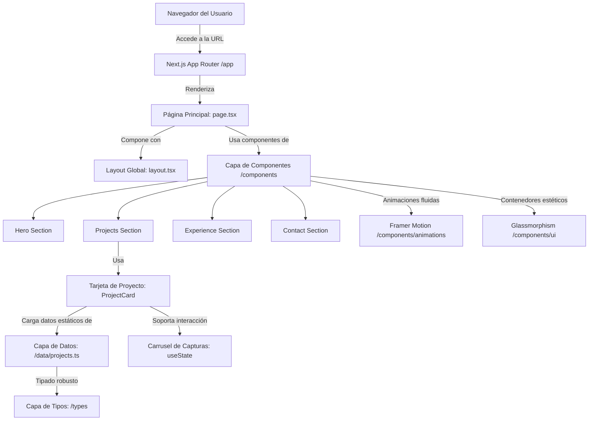

# LuisDEV Portfolio 🚀

¡Bienvenido a mi portafolio profesional de desarrollo de software! Este proyecto ha sido construido utilizando las tecnologías modernas más recomendadas para la creación de interfaces web escalables, eficientes y altamente interactivas.

## 🔗 Despliegue Oficial (Deploy)
Puedes visitar la versión en producción del portafolio a través de este enlace:
👉 **[devportfolio.luismoralesaleman25.workers.dev](https://devportfolio.luismoralesaleman25.workers.dev/)**

---

## 🎓 Propósito del Proyecto
Este portafolio sirve como mi **presentación formal para la materia de Programación**, demostrando habilidades en desarrollo front-end moderno, estructuración de código modular, tipado estático estricto y la aplicación de buenas prácticas de diseño de interfaces de usuario (UI/UX). 

El portafolio muestra proyectos reales desarrollados por mí, como **Dev-EcoLink**, una aplicación gamificada orientada a la concienciación ecológica en las playas de Paita.

---

## 🛠️ Tecnologías Utilizadas (Tech Stack)

- **Framework:** [Next.js](https://nextjs.org/) (React 19 + App Router) para renderizado rápido, optimización de fuentes y SEO impecable.
- **Lenguaje:** [TypeScript](https://www.typescriptlang.org/) para un tipado estricto que asegura un código libre de errores en tiempo de ejecución.
- **Estilos:** [Tailwind CSS](https://tailwindcss.com/) junto con variables CSS nativas para una arquitectura de diseño basada en tokens y tema oscuro dinámico.
- **Animaciones:** [Framer Motion](https://www.framer.com/motion/) para animaciones suaves basadas en físicas y transiciones dinámicas al hacer scroll (FadeUp, Stagger).
- **Iconos:** [Lucide React](https://lucide.dev/) y [React Icons](https://react-icons.github.io/react-icons/) para iconografía limpia y consistente.

---

## 📂 Estructura del Proyecto

El código fuente está estructurado de manera modular siguiendo principios de Clean Architecture y separación de conceptos en Next.js:

```bash
src/
 ├── app/                  # Capa de Ruteo y Páginas (Next.js App Router)
 │    ├── layout.tsx       # Estructura global (HTML, fuentes de Google Fonts, temas)
 │    └── page.tsx         # Página principal que ensambla las secciones
 ├── components/           # Componentes visuales organizados por sección
 │    ├── animations/      # Wrappers de Framer Motion para micro-animaciones (FadeUp, etc.)
 │    ├── hero/            # Sección de presentación principal
 │    ├── projects/        # Sección de portafolio y tarjetas con carrusel interactivo
 │    ├── ui/              # Componentes de diseño base y reutilizables (GlassCard, Container)
 │    └── ...              # Otras secciones (contacto, experiencia, etc.)
 ├── data/                 # Capa de Datos Estáticos (proyectos, navegación, experiencia)
 │    ├── projects.ts      # Configuración de proyectos mostrados (incluido Dev-EcoLink)
 │    └── navigation.ts    # Enlaces de navegación del sitio
 ├── hooks/                # Hooks personalizados de React
 ├── lib/                  # Utilidades y constantes globales
 ├── styles/               # Estilos globales y tokens de Tailwind CSS (globals.css)
 ├── types/                # Definición de interfaces y tipos TypeScript (index.ts)
 └── utils/                # Funciones auxiliares genéricas
```

---

## 📐 Diagramación y Arquitectura del Proyecto

El proyecto está diseñado bajo un modelo unidireccional de datos y una estructura de componentes modular. A continuación se detalla cómo interactúan las capas en tiempo de ejecución:



### Detalle de Diagramación:
1. **Flujo de Renderizado:** Cuando el usuario accede a la web, Next.js compila y renderiza `src/app/page.tsx` dentro de `src/app/layout.tsx`. El layout inyecta las tipografías modernas y los temas visuales.
2. **Modularización:** Cada sección de la página está aislada en su propia carpeta dentro de `src/components/`, lo que permite mantener un mantenimiento limpio y escalable.
3. **Control de Estado Local (Carrusel):** En la sección de proyectos, la tarjeta `ProjectCard` utiliza un estado interno (`useState`) para rastrear la captura de pantalla activa de los proyectos con múltiples vistas (como **Dev-EcoLink**), permitiendo cambiar de imagen con animaciones fluidas de opacidad sin necesidad de recargar la página.
4. **Capa de Datos Desacoplada:** Los textos e imágenes de los proyectos no están fijos en el HTML; se consumen desde `/data/projects.ts`, permitiendo agregar o modificar proyectos de forma inmediata y segura mediante TypeScript.
